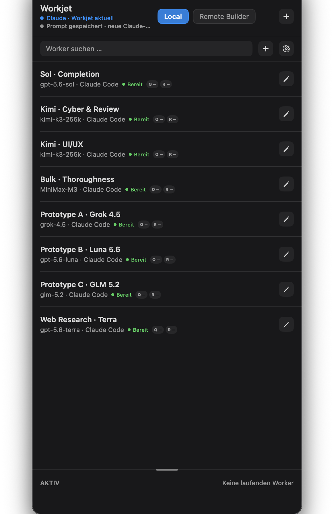

# Workjet

Workjet is an open-source native macOS menu-bar app and CLI for managing specialized coding-agent workers across local and remote computers while Claude remains the orchestrator.

[Project site](https://metric-space-ai.github.io/claude-workjet/) · [Documentation](docs/architecture.md) · [Security](SECURITY.md)

<p align="center">
  
</p>

<p align="center"><em>Actual Workjet source build with an anonymized, non-secret configuration.</em></p>

## Why Workjet exists

**Workjet - get shit done with Claude Code**

Claude can already decompose work and decide when to delegate. After that decision, the task still needs a specific worker, harness, model route, provider account, computer, repository snapshot, and tool policy. Workjet keeps those choices in one visible worker catalog and exposes one stable CLI contract. Claude can hand off a complete brief, remain the sole orchestrator, and inspect durable run evidence when the worker finishes.

The default setup covers two common paths:

- Clear, difficult work goes directly to Sol · Completion with a hard whitelist and exact checks.
- Unclear work goes first to the same bounded discovery brief on Prototype A (Grok 4.5), B (Luna 5.6), and C (GLM 5.2). Claude compares the three disposable attempts, writes a better production specification, and only then assigns the real implementation to Sol or the appropriate Kimi role.

It also includes separate defaults for exhaustive bulk work, online-only Terra research, cybersecurity review, and greenfield UI/UX. These are visible, editable prompts, not hidden routing code.

## Why not only use Claude Code's built-in agents?

Claude Code's [custom subagents](https://code.claude.com/docs/en/sub-agents) and [Agent Teams](https://code.claude.com/docs/en/agent-teams) are useful when every worker can run as another Claude Code context or when teammates need live coordination. Workjet solves a different problem: running a persistent fleet across models, harnesses, accounts, and computers without requiring workers to chat or share a task board.

| Need | Claude Code built-ins | Workjet |
| --- | --- | --- |
| Worker runtime | Claude Code subagents or Claude Code teammate sessions | Declared combinations of supported harness, model route, provider access, skills, and computer |
| Coordination | A subagent reports to its caller; Agent Teams add a shared task list and agent messaging | Fire-and-forget by design; workers do not coordinate with each other and Claude owns synthesis |
| Remote code | Use the environment and worktree available to that Claude Code session | Send an immutable Git snapshot over verified SSH or Tailscale; the worker computer needs no GitHub login |
| Isolation and handoff | Session result or worktree, depending on the chosen built-in mode | One run worktree, bounded telemetry, completion receipt, and protected `refs/workjet/<run-id>` result |
| Reusable policy | Agent definitions, skills, settings, and project instructions | One app-managed catalog that keeps role prompt, harness, model, provider route, target, and managed skills visible together |
| Failure policy | Reported inside the calling subagent or team workflow | Required worker, quota failure, and any explicitly authorized degradation remain visible and attributable |

Workjet is better when different models or harnesses, remote computers, durable run evidence, or credential-free repository transport matter. Claude Code's built-ins are simpler when one Claude session on one computer is enough, or when teammates need live discussion and steering. Workjet complements those features; it does not claim to replace them.

## Product boundary

Workjet provides configuration, execution plumbing, and observable run state. It does not replace the agent that plans and integrates the work.

- **Claude remains the orchestrator.** Claude chooses a configured worker, writes the brief, and verifies the result.
- **Workjet is not a hosted service.** The app, CLI, configuration, credentials, and run state stay on computers you control.
- **Workjet is not a second orchestrator.** It does not invent workflows or silently choose a different worker.
- **Workers are fire-and-forget.** A worker receives a bounded brief and returns output when it finishes. It cannot be steered mid-run.
- **Receipts are claims, not proof.** Structured completion receipts and telemetry help with triage. Claude still inspects the code and diff and reruns the relevant tests.
- **Provider support is configurable.** Provider names and logos identify compatible configuration paths, not commercial affiliation, endorsement, account availability, or guaranteed model access.

## Core workflow

1. Configure the provider accounts and compatible endpoints you use.
2. Keep work local or add a remote computer. Tailscale mode uses Tailscale SSH identity and policy; SSH mode uses an explicitly confirmed host key and optional local identity file.
3. Define named workers with a harness, model, provider route, instructions, skills, and target computer.
   Greppy is available for repository navigation, and the optional Web Research
   toggle adds live search plus normal page access without removing a worker's
   ordinary harness tools.
4. Start a fresh Claude Code or Claude Desktop session. The installer-managed global include exposes the current Workjet worker contract.
5. Claude invokes the stable `workjet` CLI to list, describe, start, observe, and stop a worker.
6. Workjet records bounded telemetry and, where supported, a structured completion receipt. Claude independently verifies the delivered result.

## Security model

- Provider secrets are stored as owner-only files under `~/.config/workjet/credentials/` (directory mode `0700`, files `0600`). Non-secret configuration is stored under `~/Library/Application Support/Workjet/`.
- New Tailscale computers use Tailscale SSH on port 22. Tailscale authenticates through the tailnet policy and supplies the advertised host key; Workjet does not use a local private SSH key. The target must opt in once with `sudo tailscale set --ssh`.
- Explicit SSH computers use strict, host-key-verified OpenSSH. SSH agent forwarding is disabled. Older Tailscale records keep their existing OpenSSH route until deliberately converted.
- Remote repositories are transferred as immutable Git bundles over the verified connection. The remote computer does not need a GitHub account, origin credentials, origin network access, or a forwarded SSH agent.
- Remote result import creates only `refs/workjet/<run-id>` in the source repository. It does not merge, rebase, stage, checkout, or modify the working tree.
- Worktrees and harness tool policies are useful boundaries, but they are not a complete operating-system sandbox. Pi Code can additionally require Bubblewrap on a supported Linux remote and fails closed when that requested sandbox is unavailable.

See [Remote execution and security](docs/remote-execution-security.md) and [Security policy](SECURITY.md) for the full boundary.

## Architecture

```text
Claude Code / Claude Desktop
          |
          | chooses a worker and calls the stable CLI
          v
     workjet CLI  <---->  WorkjetCore  <---->  local state / private credentials
          |                    |
          |                    +----> menu-bar UI and telemetry
          |
          +----> local harness process
          |
          +----> Tailscale SSH or strict OpenSSH
                         |
                         +----> versioned remote host runtime
                         +----> detached Git-bundle worktree
```

The menu-bar app edits configuration and the visible managed prompt. The CLI is the execution boundary used by Claude. WorkjetCore owns persistence, provider routing, harness lifecycle, workspace snapshots, remote protocol validation, and telemetry. See [Architecture](docs/architecture.md).

## Build from source

Requirements: macOS 14 or newer, Apple Silicon, Git, and Xcode command-line tools.

```sh
git clone https://github.com/metric-space-ai/claude-workjet.git
cd claude-workjet
xcode-select -p
swift test --package-path app
swift run --package-path app WorkjetApp
```

The app appears in the menu bar. This path uses a debug build and does not install or change your global Claude prompt.

To create the local release-shaped app bundle:

```sh
brew install librsvg
./app/build-app.sh
open app/dist/Workjet.app
```

Without release credentials, `build-app.sh` creates an ad-hoc-signed Apple-Silicon build for local use. For test, Xcode, packaging, installer, Pi sidecar, and release verification commands, see [app/README.md](app/README.md).

## Release status

There is no public signed binary release yet. Building from source is supported.

A `v*` tag can create a GitHub Release only after the repository workflow completes Developer ID signing, notarization, stapling, Gatekeeper assessment, archive inspection, and SHA-256 checksum generation. Until that workflow succeeds for a tag, do not treat locally built ZIP files as public releases. See [Release process](docs/releasing.md).

## Documentation

- [Developer build and verification guide](app/README.md)
- [Architecture](docs/architecture.md)
- [Remote execution and security](docs/remote-execution-security.md)
- [Workers, skills, receipts, and telemetry](docs/workers-skills-telemetry.md)
- [Troubleshooting](docs/troubleshooting.md)
- [Contributing](CONTRIBUTING.md)
- [Security policy](SECURITY.md)
- [Changelog](CHANGELOG.md)
- [Release acceptance stories](docs/WORKJET_USER_STORIES.md)
- [Current release gaps](docs/WORKJET_RELEASE_GAPS.md)
- [t3code design reference notes](docs/T3CODE_REMOTE_INTEGRATION.md)

## License

Workjet is available under the [MIT License](LICENSE).
